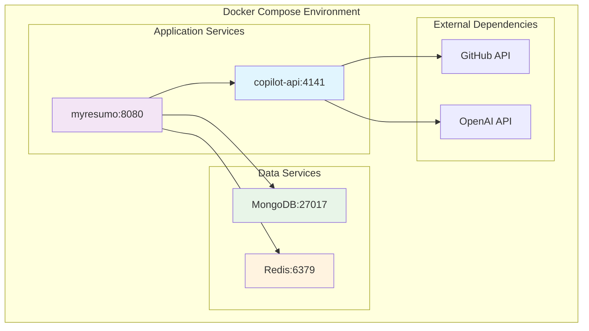
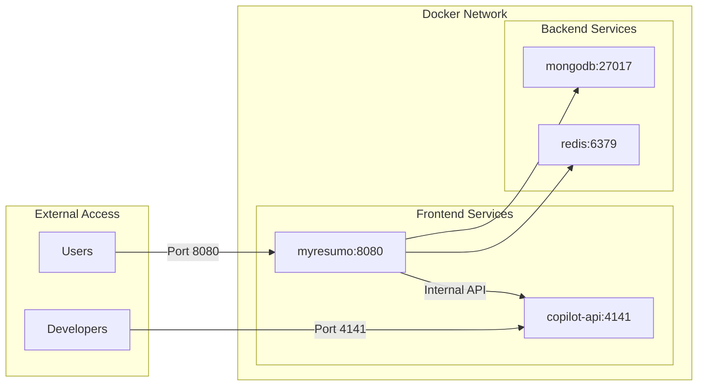
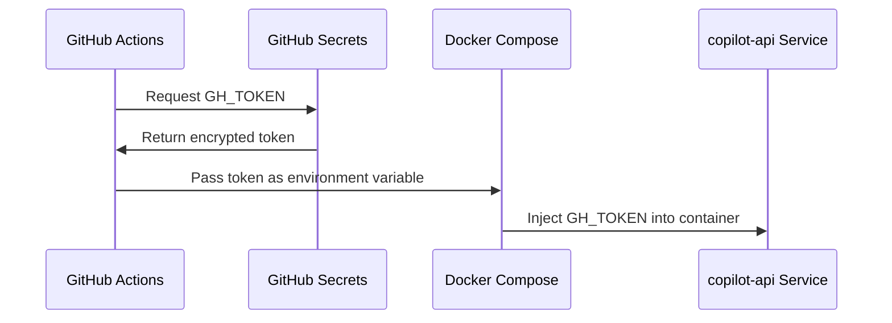
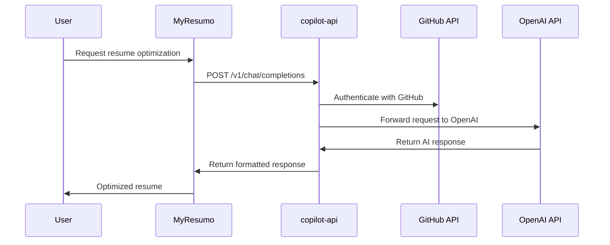
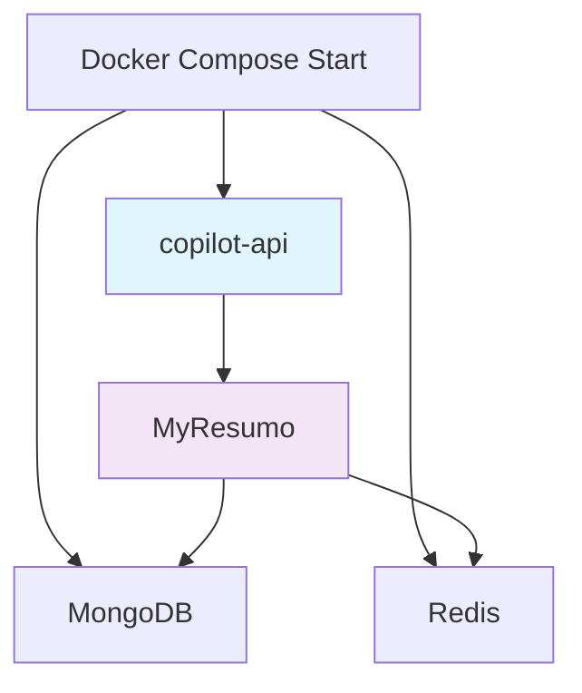
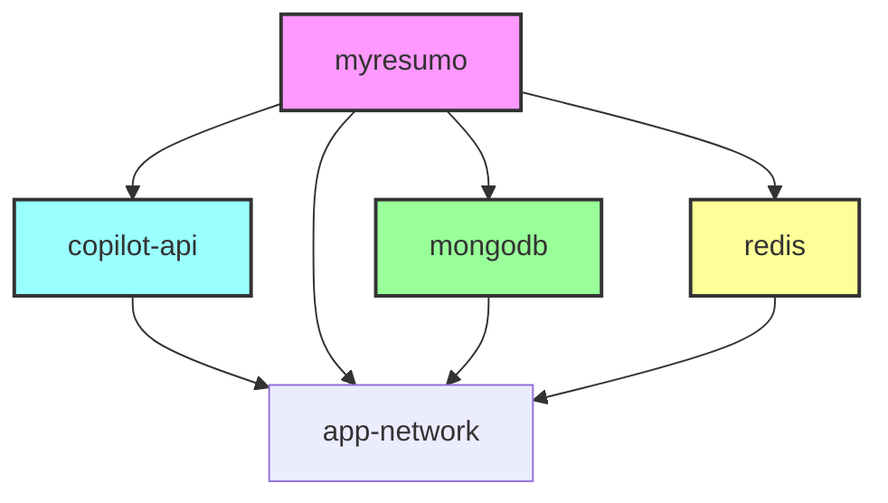

# Docker Compose Configuration Design

## Overview

This design document outlines a Docker Compose configuration that orchestrates multiple services including a copilot-api service and the MyResumo AI-powered resume customization platform. The composition includes all necessary dependencies and supporting services to create a complete development and production environment.

## Architecture

### Service Architecture Diagram



### Network Architecture



## Service Specifications

### Primary Application Services

#### copilot-api Service
- **Purpose**: GitHub Copilot API integration service
- **Port Mapping**: 4141:4141
- **Build Context**: Current directory (.)
- **Environment Variables**:
  - `GH_TOKEN`: GitHub personal access token sourced from GitHub Secrets
- **Security**: Token retrieved from GitHub repository secrets for public fork safety
- **Restart Policy**: unless-stopped (automatic restart except manual stops)

#### myresumo Service  
- **Purpose**: AI-powered resume customization platform
- **Port Mapping**: 8080:8080
- **Base Image**: ghcr.io/analyticace/myresumo:latest
- **Environment Variables**:
  - `API_KEY`: OpenAI-compatible API key (can be placeholder when using copilot-api)
  - `API_BASE`: Internal copilot-api endpoint (http://copilot-api:4141)
  - `MODEL_NAME`: OpenAI model identifier (gpt-3.5-turbo, gpt-4, etc.)
  - `MONGODB_URI`: Database connection string
- **Dependencies**: MongoDB, Redis (optional), copilot-api
- **Network**: Communicates with copilot-api via internal Docker network

### Supporting Data Services

#### MongoDB Database
- **Purpose**: Primary data persistence for MyResumo application
- **Port Mapping**: 27017:27017
- **Features**:
  - Resume storage and version management
  - User data and preferences
  - Job description analysis results
  - ATS scoring history

#### Redis Cache (Optional)
- **Purpose**: Caching layer for improved performance
- **Port Mapping**: 6379:6379
- **Use Cases**:
  - API response caching
  - Rate limiting storage
  - Session management
  - Temporary data storage

## GitHub Secrets Integration

### Public Fork Security Requirements

Since this is a public fork, sensitive information like GitHub tokens must be handled through GitHub repository secrets to prevent exposure in the codebase.

#### GitHub Secrets Configuration



#### Required Repository Secrets

| Secret Name | Purpose | Usage |
|-------------|---------|-------|
| `GH_TOKEN` | GitHub API access token | copilot-api authentication and OpenAI proxy |
| `OPENAI_API_KEY` | OpenAI service authentication (optional) | Fallback for copilot-api if needed |
| `MONGODB_PASSWORD` | Database authentication | Production MongoDB access |

#### Setting Up Repository Secrets

1. Navigate to repository **Settings** → **Secrets and variables** → **Actions**
2. Click **New repository secret**
3. Add required secrets:
   - **Name**: `GH_TOKEN`
   - **Value**: Your GitHub personal access token
4. Repeat for other sensitive variables

### GitHub Actions Workflow Integration

#### CI/CD Pipeline with Secrets

```yaml
name: Deploy with Docker Compose

on:
  push:
    branches: [main]
  pull_request:
    branches: [main]

jobs:
  deploy:
    runs-on: ubuntu-latest
    steps:
      - uses: actions/checkout@v3
      
      - name: Create environment file
        run: |
          echo "GH_TOKEN=${{ secrets.GH_TOKEN }}" >> .env
          echo "API_KEY=sk-placeholder" >> .env
          echo "API_BASE=http://copilot-api:4141" >> .env
          echo "MODEL_NAME=gpt-3.5-turbo" >> .env
          echo "MONGODB_URI=mongodb://mongodb:27017/myresumo" >> .env
      
      - name: Deploy with Docker Compose
        run: |
          docker-compose up -d
```

#### Local Development with Secrets

For local development, create a `.env` file (never commit this):

```bash
# .env (add to .gitignore)
GH_TOKEN=your_github_token_here
API_KEY=sk-placeholder_or_real_openai_key
API_BASE=http://copilot-api:4141
MODEL_NAME=gpt-3.5-turbo
MONGODB_URI=mongodb://mongodb:27017/myresumo
```

## Inter-Service Communication

### copilot-api as OpenAI Proxy

The copilot-api service acts as an OpenAI-compatible proxy, providing AI functionality to the MyResumo application through internal Docker networking.

#### Communication Flow



#### Internal API Configuration

- **Endpoint**: `http://copilot-api:4141`
- **Protocol**: HTTP (internal Docker network)
- **API Compatibility**: OpenAI v1 API format
- **Authentication**: Handled by copilot-api service
- **Benefits**:
  - Centralized API key management
  - Rate limiting control
  - Request/response logging
  - Cost optimization through GitHub Copilot credits

#### Service Startup Dependencies



MyResumo service must wait for copilot-api to be ready before starting, ensuring the internal API endpoint is available.

## Docker Compose Configuration Structure

### Version and Networks

```yaml
version: "3.8"

networks:
  app-network:
    driver: bridge
```

### Volume Management

```yaml
volumes:
  mongodb_data:
    driver: local
  redis_data:
    driver: local
```

### Service Dependencies



## Environment Configuration

### Environment Variables Management

| Service | Variable | Purpose | Source | Example Value |
|---------|----------|---------|--------|---------------|
| copilot-api | GH_TOKEN | GitHub API authentication | GitHub Secrets | ${{ secrets.GH_TOKEN }} |
| myresumo | API_KEY | OpenAI-compatible API key | Environment/.env | sk-placeholder_or_real_key |
| myresumo | API_BASE | Internal copilot-api endpoint | Environment/.env | http://copilot-api:4141 |
| myresumo | MODEL_NAME | OpenAI model selection | Environment/.env | gpt-3.5-turbo |
| myresumo | MONGODB_URI | Database connection | Environment/.env | mongodb://mongodb:27017/myresumo |

### Security Considerations

#### Environment Variables Security
- Use `.env` files for local development
- **GitHub Secrets Integration**: For public forks, sensitive tokens must be stored in GitHub repository secrets
- Utilize Docker secrets for production deployment
- Implement environment variable validation
- Rotate API keys regularly
- Never commit sensitive tokens to version control

#### Network Security
- Internal service communication via Docker network
- Expose only necessary ports to host
- Implement proper firewall rules
- Use non-root containers where possible

## Health Checks and Monitoring

### Service Health Monitoring

```yaml
healthcheck:
  test: ["CMD", "curl", "-f", "http://localhost:8080/health"]
  interval: 30s
  timeout: 10s
  retries: 3
  start_period: 40s
```

### Logging Configuration

```yaml
logging:
  driver: "json-file"
  options:
    max-size: "10m"
    max-file: "3"
```

## Development vs Production Profiles

### Development Profile Features
- Local volume mounts for hot reloading
- Debug mode enabled
- Additional development tools
- Relaxed security settings

### Production Profile Features
- Optimized image builds
- Resource limits and reservations
- Enhanced security configurations
- Proper secret management

## Deployment Strategies

### Local Development Deployment (Public Fork)
1. Fork the repository to your GitHub account
2. Set up repository secrets in your forked repository:
   - Navigate to Settings → Secrets and variables → Actions
   - Add `GH_TOKEN` with your GitHub personal access token
   - Add `DEEPSEEK_API_KEY` with your AI service key
3. Clone your forked repository locally
4. Create `.env` file with required environment variables (never commit this)
5. Execute `docker-compose up -d`
6. Access services via localhost ports

### Production Deployment (Public Fork)
1. Configure GitHub Actions workflow with proper secrets
2. Use production-specific compose override with secrets integration
3. Implement proper secret management through GitHub repository secrets
4. Configure reverse proxy (nginx/traefik) with SSL termination
5. Set up monitoring and logging aggregation

## Testing Strategy

### Integration Testing
- Service connectivity validation
- Database migration verification
- API endpoint functionality
- Environment variable injection

### Performance Testing
- Load testing on exposed ports
- Database connection pooling
- Memory and CPU usage monitoring
- Network latency measurements

## Maintenance and Operations

### Backup Procedures
- MongoDB data volume backup
- Configuration file versioning
- Environment variable backup
- Container image registry maintenance

### Update Procedures
- Rolling updates for zero-downtime
- Database migration handling
- Configuration change management
- Service dependency updates

### Troubleshooting

#### Common Issues
- Port conflicts with existing services
- Environment variable misconfiguration
- **GitHub Secrets Access**: Secrets not available in forked repository
- **Token Permissions**: GitHub token lacks required scopes
- Network connectivity between services
- Volume mount permission issues
- **Public Fork Security**: Accidental token exposure in logs or code

#### GitHub Secrets Troubleshooting
- Verify secrets are set in repository settings
- Check GitHub Actions logs for secret injection failures
- Ensure GitHub token has appropriate permissions/scopes
- Validate secret names match workflow references
- Confirm fork has access to organization secrets (if applicable)

#### Debugging Tools
- Docker logs analysis
- Container inspection commands
- Network connectivity testing
- Resource usage monitoring